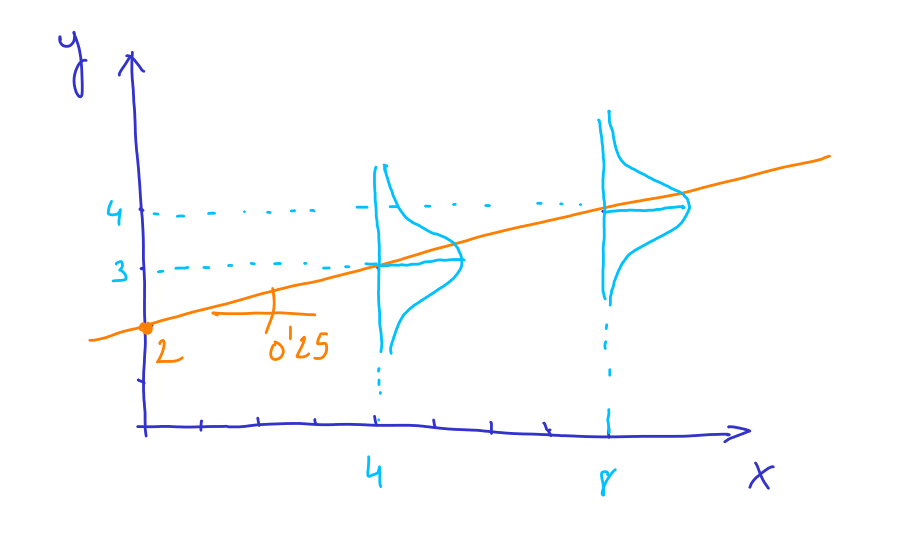

# Simulación de una variable normal

Sea la variable aleatoria $X \sim N(\mu,\sigma)$. Cuando simulamos una variable con R, la probabilidad de que la variable $X$ tome un valor en un intervalo concreto $[x_i,x_j]$ es proporcional al valor del aŕea de la función de densidad evaluada entre los puntos $x_i$ y $x_j$. Es decir:

$$
P(X \in [x_i,x_j]) = k \int _{x_i}^{x_j} f(x)dx
$$

donde k es un a constante y $f(x_j) = \frac{1}{\sigma \sqrt{2 \pi}}exp \left( \frac{1}{2 \sigma^2}(x_j - \mu)^2 \right)$. 

Por ejemplo, vamos a analizar la variable $X \sim N(3,1)$:

```{r}
curve(dnorm(x, mean = 3, sd = 1), from = -2, to = 8, col = "blue", lwd = 2)
```

Cuando generamos valores aleatorios de la variable $X$, lo más probable será obtener valores entre 2 y 4, y será menos frecuente obtener valores entre 0 y 2 y entre 4 y 6. Veamos un ejemplo:

```{r}
set.seed(123)
(x = round(rnorm(20, 3, 1),2) )
```

```{r}
table(cut(x, breaks = -2:8))
```

Por tanto, el histograma de los numeros aleatorios deberá parecerse a la función de densidad simulada:

```{r}
hist(x, breaks = -2:8, freq = F)
curve(dnorm(x, mean = 3, sd = 1), col = "blue", lwd = 2, add = T)
```

Cuantos más números aleatorios generemos, mejor será la aproximación:

```{r}
set.seed(123)
x = round(rnorm(1000, 3, 1),2)
hist(x, freq = F)
curve(dnorm(x, mean = 3, sd = 1), from = -2, to = 8, col = "blue", lwd = 2, add = T)
```

# Simulación de modelos de regresión 

## Simulación de "y" para un valor concreto de "x"

Vamos a estudiar el siguiente modelo:

$$
Y = 2 + 0.25x + U
$$
donde $U$ es una variable aleatoria normal, $U \sim N(0,1)$. Por contra, $x$ es un número, no es variable aleatoria. En cambio, $Y$ si es variable aleatoria debido a la presencia de $U$ (la suma de un número y una variable aleatoria nos da otra variable aleatoria). Su valor dependerá de $x$. Esto se expresa matemáticamente escribiendo $Y|x$. Por las propiedades de la distribución normal (ver [Apéndice: Propiedades de las variables aleatorias normales](apendice_normal.html))

$$
Y|x \sim N(2+0.25x,1)
$$

$$
E[Y|x] =  E[2+0.25x + U] = 2+0.25x
$$

$$
Var[Y|x] =  E[2+0.25x + U] = Var[U]
$$

Vamos a comprobarlo mediante simulación. Primero vamos a simular el término de error, $U$:

```{r}
set.seed(1)
u = rnorm(10000, 0, 1)
hist(u)
```

Y a continuación vamos a simular el valor de $Y$ para $x = 4$

```{r}
x = 4
y = 2 + 0.25*x + u
```

Según los visto anteriormente, para $x = 4$ se tendría que cumplir que que $Y|x=4 \sim N(2+0.25*4,1)$.

```{r}
hist(y, freq = F, main = "Histograma de Y|x=4")
curve(dnorm(x,2 + 0.25*4 ,1), col = "blue", lwd = 2, add = T)
```

La esperanza y la varianza se pueden calcular a partir de los valores simulados utilizando la **ley de los grandes números**:

$$
\bar{y} = \frac{1}{N}\sum y_i \rightarrow E[Y|x=4]
$$
$$
s^2_y = \frac{1}{N-1} \sum (y_i - \bar{y})^2 \rightarrow Var[Y|x = 4]
$$

```{r}
# aproximación de 2 + 0.25*4 = 3
mean(y)
# aproximación de 1
var(y)
```

Para $x = 8$ se tiene $Y|x = 8 \sim N(2+0.25*8,1)$:

```{r}
x = 8
y = 2 + 0.25*x + u
hist(y, freq = F, main = "Histograma de Y|X=8")
curve(dnorm(x,2 + 0.25*8 ,1), col = "blue", lwd = 2, add = T)
```

```{r}
# aproximación de 2 + 0.25*8
mean(y)
# aproximación de 1
var(y)
```

En el fondo, lo que tenemos es:


ya que 2 + 0.25x es la ecuación de una recta. Para cada valor de $x$ la variable $Y|x$ tiene distribución normal. Como se ha visto:

$$
Y|x \sim N(2+0.25x,1)
$$

Este modelo se suele escribir también como

$$
Y = 2 + 0.25x + U, \quad U \sim N(0,1)
$$

En general, las variables aleatorias las escribiremos en mayúscula y los datos (obtenidos por simulación en este caso) en minúscula.

## Simulación de "y" para un conjunto de "x"

En lugar de simular 1000 valores de $Y$ para un valor concreto de $x$ vamos a simular un valor de $Y$ para x = [0,2,4,6,8,10]. 

```{r}
set.seed(1)
x = c(0,2,4,6,8,10) 
u = rnorm(length(x))
y = 2 + 0.25*x + u
plot(x,y)
abline(a=2, b=0.25, col = "red") # añadimos la recta
```

Como observamos, debido al caracter aleatorio de $U$, los valores generados de $Y$ no están sobre la recta $2 +0.25x$. 

Este proceso se puede repetir tantas veces como queramos obteniendo diferentes conjuntos de puntos que proceden del mismo modelo:

```{r}
set.seed(2)
x = c(0,2,4,6,8,10) 
u = rnorm(length(x))
y = 2 + 0.25*x + u
plot(x,y)
abline(a=2, b=0.25, col = "red") # añadimos la recta
```

## Cálculo del modelo de mínimos cuadrados a partir de un conjunto de valores simulados

Si consideramos el conjunto de puntos simulados:

```{r}
set.seed(1)
x = c(0,2,4,6,8,10) 
u = rnorm(length(x))
y = 2 + 0.25*x + u
plot(x,y)
```

A partir de estos puntos podemos calcular cual es la recta que mejor se ajusta en el sentido de mínimos cuadrados:

$$
y_i = b_0 + b_1 x_i + e_i
$$

```{r}
m = lm(y ~ x)
coefficients(m)
```

```{r}
plot(x,y)
abline(a=2, b=0.25, col = "red")
abline(m, col = "blue")
```

Como vemos, los valores calculados se parecen mucho a 2 y 0.25, ya que estamos calculando "la mejor" recta para unos datos que proceden de una recta.

Si volvemos a simular los puntos

```{r}
set.seed(2)
u = rnorm(length(x))
y = 2 + 0.25*x + u
m = lm(y ~ x)
coefficients(m)
```

Volvemos a obtener valores parecidos a 2 y 0.25. Veamos qué ocurre si repetimos este proceso 1000 veces.

```{r}
set.seed(1)
aa = rep(0,1000)
bb = rep(0,1000)
for (i in 1:1000){
  u = rnorm(length(x))
  y = 2 + 0.25*x + u
  m = lm(y ~ x)
  aa[i] = coef(m)[1]
  bb[i] = coef(m)[2]
}
```

```{r}
hist(aa, freq = F)
```

```{r}
hist(bb, freq = F)
```

Es decir, parece que tenemos dos variables aleatorias (recordad que variables aleatorias -> función de densidad, datos simulados -> histograma). Para verificar ésto, vamos a ver las ecuaciones con los que calculamos los valores de mínimos cuadrados:

$$
\begin{bmatrix}
b_0 \\
b_1
\end{bmatrix}
= 
(X^T X)^{-1} (X^T y)
$$

donde $y = [y_1 \ y_2 \cdots \ y_{6}]^T$. El equivalente *teorico* de simular 1000 veces y obtener 1000 valores de $b_0$ y $b_1$ es considerar variables aleatorias $Y$ en lugar de datos concretos $y$. 

$$
\begin{bmatrix}
b_0 \\
b_1
\end{bmatrix}
= 
(X^T X)^{-1} (X^T Y)
$$
donde 

$$
Y_i \sim N(2+0.25x_i, 1), \ i = 1,2,\cdots,6
$$

La matriz $X$ es una matriz de números, conocida:

$$
X =
\begin{bmatrix}
1 & 0 \\
1 & 2 \\
1 & 4 \\
1 & 6 \\
1 & 8 \\
1 & 10 \\
\end{bmatrix}
$$

Por tanto $(X^T X)^{-1} (X^T Y)$ son dos variables aleatorias. Teóricamente, $b_0$ y $b_1$ son dos variables aleatorias. Lo deseable sería conocer su función de densidad. Para ello, sabemos que

$$
Y_i \sim N(2+0.25x_i, 1), \ i = 1,2,\cdots,6
$$

En forma matricial, las 6 variables aleatorias se agrupan formando:

$$
Y
=
\begin{bmatrix}
Y_1 \\
Y_2 \\
\cdots \\
Y_{6}
\end{bmatrix}
=
\begin{bmatrix}
1 & x_1 \\
1 & x_2 \\
\cdots & \cdots \\
1 & x_{6}
\end{bmatrix}
\begin{bmatrix}
2 \\ 0.25
\end{bmatrix}
+
\begin{bmatrix}
U_1 \\
U_2 \\
\cdots \\
U_{6}
\end{bmatrix}
\Rightarrow
$$

$$
Y \sim N(X \beta, \mathrm I)
$$

donde $\beta = [2 \ 0.25]^T$ e $\mathrm I$ es la  matriz identidad de orden 6. Por tanto, teniendo en cuenta las propiedades de las distribuciones normales

$$
(X^T X)^{-1} X^T Y \sim N(\beta, (X^T X)^{-1})
$$

ya que 

$$
E[(X^T X)^{-1} X^T Y] = (X^T X)^{-1} X^T E[Y] = \beta
$$

$$
Var[(X^T X)^{-1} X^T Y] = (X^T X)^{-1} X^T Var[Y] X (X^T X)^{-1} = (X^T X)^{-1}
$$

Es decir, si calculamos $(X^T X)^{-1}$:

```{r}
X = cbind(rep(1,length(x)), x)
solve(t(X) %*% X)
```

entonces el histograma de *aa* corresponde a una N(2,0.524) y el histograma de *bb* corresponde a una N(0.25,0.014)

```{r}
hist(aa, freq = F)
curve(dnorm(x,2,sqrt(0.524)), add = T, col = "blue", lwd = 2)
```

```{r}
hist(bb, freq = F)
curve(dnorm(x,0.25,sqrt(0.014)), add = T, col = "blue", lwd = 2)
```

